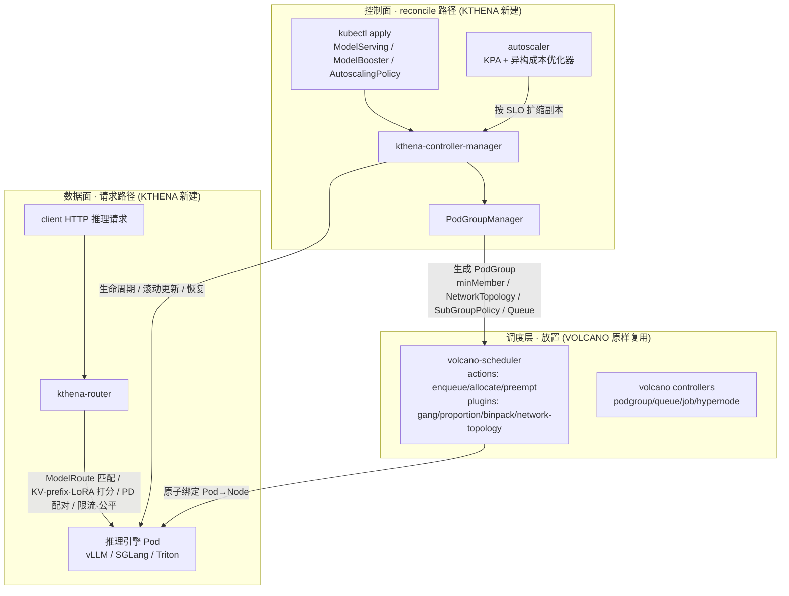
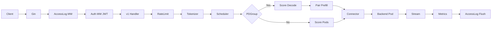
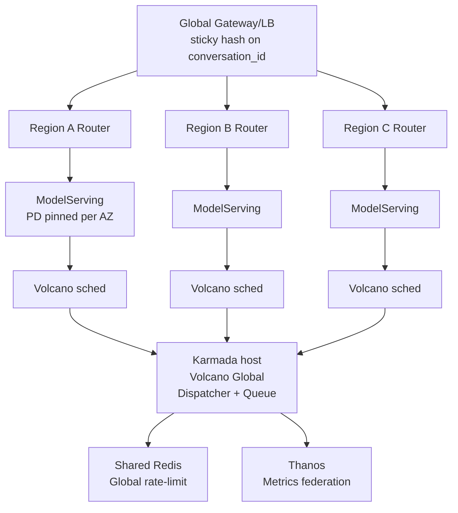

# Kthena 架构深度拆解 与 主流 LLM Serving 平台对比

> **TL;DR** — Kthena 是 Volcano 社区孵化的 Kubernetes 原生 LLM 推理平台，以"控制面 CRD 编排 + 数据面智能路由"为核心，深度复用（而非修改）Volcano 的 gang / 拓扑调度，在 PD 分离、KV-Cache Aware 路由、异构成本驱动扩缩容、Token 级限流四个维度构成差异化能力。
>
> 本文首先回答一个关键问题——**为什么原生 Volcano 无法支撑 LLM 在线推理，必须新建一个项目**（结合两个仓库的代码证据）；再做代码级架构深拆；然后与 llm-d / KServe / Dynamo / AIBrix 等主流栈对比；最后讨论 Kthena + Volcano Global 的多集群部署模式。

---

## 目录

1. [Kthena 整体架构](#一kthena-整体架构)
2. [为什么原生 Volcano 无法支撑，必须新建 Kthena](#二为什么原生-volcano-无法支撑必须新建-kthena)
3. [CRD 设计深拆](#三crd-设计深拆)
4. [控制面 Controller 深拆](#四控制面-controller-深拆)
5. [数据面 Router 深拆](#五数据面-router-深拆)
6. [推理引擎集成与 PD 分离](#六推理引擎集成与-pd-分离)
7. [可观测性](#七可观测性)
8. [版本迭代要点](#八版本迭代要点)
9. [Kthena vs llm-d 深度对比](#九kthena-vs-llm-d深度对比)
10. [与其他主流 LLM Serving 平台横向对比](#十与其他主流-llm-serving-平台横向对比)
11. [Kthena + Volcano Global 多集群部署](#十一kthena--volcano-global-多集群部署)
12. [总结与选型建议](#十二总结与选型建议)

---

## 一、Kthena 整体架构

Kthena 是 Volcano 社区于 2025-09 启动、2026-01 经 CNCF Blog 正式向云原生社区披露的 Kubernetes 原生 LLM 推理平台，由华为云作为发起方主导，目标是用声明式 API + 智能路由解决生产级 LLM 推理在 K8s 上"最后一公里"的问题（[Introducing Kthena - CNCF Blog](https://www.cncf.io/blog/2026/01/28/introducing-kthena-llm-inference-for-the-cloud-native-era/)）。

### 1.1 二元面拓扑

| 面 | 组件 | 说明 |
|---|---|---|
| **控制面** | `kthena-controller-manager` | 单进程多 Controller（ModelServing / ModelBooster / Autoscaler / LWS），通过 `--controllers` 选择性启用；Lease 名 `kthena.controller-manager`，租期 15s / 续约 10s / 重试 2s。Webhook Server 在 `:8443` 暴露 6 个 validate / mutate 端点。 |
| **数据面** | `kthena-router` | Gin HTTP Server，默认 `:8080`；通过 informer 维护 ModelRoute / ModelServer / Gateway / HTTPRoute / InferencePool 本地 datastore；支持 `REDIS_HOST` 启用跨副本 on-flight 计数，`DRAIN_TIMEOUT` 默认 5m 控制优雅停机。 |

### 1.2 仓库布局

```text
cmd/{kthena-controller-manager, kthena-router}
pkg/apis/workload/v1alpha1     # ModelServing, ModelBooster, AutoscalingPolicy(Binding), ServingGroup
pkg/apis/networking/v1alpha1   # ModelRoute, ModelServer
pkg/model-serving-controller/  # ModelServing reconciler + plugins + podgroupmanager
pkg/model-booster-controller/  # 一站式包装 + 模板渲染 (vllm.yaml, vllm-pd.yaml)
pkg/autoscaler/                # scaler, optimizer, algorithm, histogram
pkg/kthena-router/             # router, scheduler, controllers, backend, connectors, metrics
pkg/controller/                # 主编排器，串接 Leader Election + 三类 Controller
docs/proposal/                 # 设计提案 (kvcache, gang-scheduling, role-rollingupdate, ...)
charts/{workload, networking}  # Umbrella Helm Chart
```

### 1.3 控制面与数据面解耦部署

两侧拥有各自的 CRD 集合与镜像，可以独立部署：既允许"仅用 Kthena Router 接管已有的 vLLM 自管集群"，也允许"仅用控制面 + 让流量交给 Envoy / Gateway API Inference Extension"。这种解耦在主流栈中独此一家——KServe 强耦 Knative / Istio，llm-d 必须配合 GAIE Gateway 才能用全功能（[Kthena GitHub](https://github.com/volcano-sh/kthena)）。

---

## 二、为什么原生 Volcano 无法支撑，必须新建 Kthena

> **这是本文的核心问题。** 既然 Kthena 复用了 Volcano 调度，为什么不直接扩展 Volcano（加个 vcjob 类型，或写个调度插件），而要新建一整套控制面 + 数据面？答案是：**Volcano 在设计与代码层面只是一个"Pod 放置调度器"，LLM 在线推理需要的是三个它结构上无法承载的更高层——工作负载生命周期控制面、请求级数据面、推理感知扩缩容。**

### 2.1 一句话结论

Volcano 只回答一个问题：*"给定一组即将存在的 Pod，应该把它们放到哪些节点上、以什么顺序与原子性放置？"* 它工作在 **Pod 放置层（pod-placement layer）** 并刻意止步于此。LLM 推理需要三个 Volcano 结构上无法托管的额外层：

- **工作负载生命周期控制面** —— 长运行、按角色组织、可滚动更新的服务拓扑；
- **数据面** —— 一个检查推理请求并做 KV / PD / LoRA 感知路由的 HTTP 代理；
- **推理感知扩缩容** —— 由 TTFT / 吞吐 / KV-cache 占用 / 队列深度驱动的自动扩缩。

Volcano 维护者明确表述了这一分工：Kthena "将 Volcano 的能力扩展到 AI 训练之外"，把"批计算的拓扑感知与 Gang 调度能力应用到在线 LLM 推理"，并且"不是替换已有推理引擎……Kthena 是架在它们之上的智能编排层"（[Introducing Kthena - CNCF](https://www.cncf.io/blog/2026/01/28/introducing-kthena-llm-inference-for-the-cloud-native-era/)）。

### 2.2 Volcano 的真实边界（代码为证）

Volcano 自己的 README 定义得很精确：*"Volcano is a Kubernetes-native batch scheduling system, extending and enhancing the capabilities of the standard kube-scheduler"*——它是一个 **kube-scheduler 的替换 / 增强**，构建在 `kube-batch` 之上（[Volcano README](https://github.com/volcano-sh/volcano/blob/master/README.md)）。

界定这一层的具体组件：

| 关注点 | Volcano 制品 | 代码锚点 |
|---|---|---|
| 原子组放置 | `PodGroup` CRD（`MinMember`, `MinResources`, `Queue`, `NetworkTopology`, `SubGroupPolicy`） | `staging/.../apis/scheduling/v1beta1/types.go` |
| 批工作负载对象 | `Job`（vcjob）CRD，含 `minAvailable`, `MaxRetry`, 生命周期 `Policies` | `staging/.../apis/batch/v1alpha1/job.go` |
| 多租户配额 / 公平共享 | `Queue` CRD（`QueueStateOpen/Closed`） | 同 `scheduling/v1beta1/types.go` |
| 调度流水线（动词） | actions：`enqueue` / `allocate` / `preempt` / `backfill` / `reclaim` / `shuffle` | `pkg/scheduler/actions/` |
| 调度策略 | plugins：`gang` / `proportion` / `binpack` / `drf` / `capacity` / `network-topology-aware` / `task-topology` / `numaaware` / `deviceshare` | `pkg/scheduler/plugins/` |
| 控制器（注意范围！） | `job` / `jobflow` / `jobtemplate` / `cronjob` / `queue` / `podgroup` / `hypernode` / `sharding` | `pkg/controllers/` |

调度器入口 `cmd/scheduler/main.go` 只 import 了 `pkg/scheduler/actions` 与 `pkg/scheduler/plugins`——它的宇宙就是"对节点 / Pod 缓存执行 actions + plugins"。

**Volcano 明确不做的事（由代码缺失证明）：**

- **没有推理数据面。** 在 `pkg/` 与 `cmd/` 中 grep `TTFT`、`kvcache`、`prefix cache`、`/v1/chat/completions`、`prefill`、`decode`，唯一命中的 "router" 是准入 webhook（`pkg/webhooks/router/server.go`，CRD 校验用的 HTTP server），**绝非推理流量**。Volcano 从不接触一个 HTTP 推理请求。
- **没有服务工作负载控制器。** `pkg/controllers/` 全是 `job/jobflow/cronjob/queue/podgroup/...` 这类批 / 调度对象，没有任何 ModelServing / 推理控制器。
- **没有推理感知扩缩容。** 不存在由 TTFT / TPOT / KV-cache 驱动的 KPA scaler；Volcano 通过 gang / 队列准入来"调度作业"，而非按延迟 SLO 扩缩在线副本。
- Kthena 的 gang 调度提案甚至把这条边界写成显式 **non-goal**：*"Custom scheduler: We will not implement a custom scheduler, but use Volcano's existing capabilities"*（[docs/proposal/gang-scheduling.md](https://github.com/volcano-sh/kthena/blob/main/docs/proposal/gang-scheduling.md)）。

### 2.3 语义错配：vcjob 是"运行到完成"

`Job`（vcjob）本质是 **批处理 / 运行到完成（run-to-completion）**。它的 phase 枚举（`staging/.../batch/v1alpha1/job.go`）是 `Pending → Running → Completing → Completed`，外加 `Restarting/Aborted/Terminated/Failed`，并带一个 `MaxRetry` 计数器。这是"一个训练作业跑完"的生命周期。

而 LLM 推理服务恰恰相反：它是 **长运行在线服务**，永远不应到达 "Completed"，必须支持滚动更新、partition / canary、按角色恢复、零停机换模型。没有任何批 CRD 能表达"永远保活 N 组 role-P + role-D 的 ServingGroup，并一次滚一组"。**这个缺口正是 Kthena `ModelServing` 存在的全部理由。**

### 2.4 能力缺口逐项映射

| LLM 推理需要 | Volcano 为何结构上无法提供 | 填补它的 Kthena 组件 / CRD | 代码锚点 |
|---|---|---|---|
| 长运行、角色化、可滚动更新的服务工作负载 | vcjob 运行到完成（`Completed` 相、`MaxRetry`）；无角色 / PD 拓扑、无滚动更新 / partition / canary、无按角色恢复 | `ModelServing → ServingGroup → Role` 层级；`RolloutStrategy`（`MaxUnavailable`, `Partition`）；`RecoveryPolicy` | `pkg/apis/workload/v1alpha1/model_serving_types.go`；`model_serving_controller.go` 的 `manageRollingUpdate()` |
| 检查 HTTP 推理请求的数据面 | Volcano 是纯调度器，从不接触请求体 / 头 / token | `kthena-router` 代理；解析 OpenAI 请求体取模型名 | `pkg/kthena-router/handlers/request.go`（`ParseOpenAIRequestBody`） |
| 模型感知请求路由（KV / prefix / PD / LoRA 感知） | 调度器里没有任何路由概念 | Router 调度框架（`Filter`/`Score`/`PostSchedule` 插件）：`kvcache_aware` / `prefix` / `lora_affinity` / `least_latency` | `pkg/kthena-router/scheduler/framework/interface.go`；`scheduler/plugins/*.go` |
| 路由期 CRD（模型 URI 匹配、加权 / canary、限流） | 超出调度器范围 | `ModelRoute`（按 header/URI/body 匹配、加权 `TargetModel`、`RateLimit`）与 `ModelServer`（`InferenceEngine`, `PDGroup`, `KVConnector`） | `pkg/apis/networking/v1alpha1/{modelroute,modelserver}_types.go` |
| PD 分离编排 + KV 连接器 | 无 P/D 角色概念、无 KV 传输连接器概念 | `PDGroup`（`GroupKey`, `PrefillLabels`, `DecodeLabels`），`KVConnectorSpec`（`http`/`nixl`/`lmcache`/`mooncake`） | `modelserver_types.go`；`pkg/kthena-router/connectors/*.go` |
| 推理感知扩缩容（TTFT / 吞吐 / KV / 队列 + 成本） | Volcano 通过 gang / 队列准入调度作业，而非按 SLO 扩缩在线副本；无 metric 驱动 KPA、无成本优化器 | `Autoscaler`（KPA stable/panic + tolerance + 稳定窗口）+ 异构 **成本优化器** | `autoscalingpolicy_types.go`；`pkg/autoscaler/autoscaler/optimizer.go`（`ReplicaBlock.cost`, `CostExpansionRatePercent`） |
| 模型管理（模型 URI、LoRA、canary） | 无模型概念 | `ModelBooster`（`ModelURI` 支持 `hf://`/`s3://`/`pvc://`/`ms://`，后端类型 `vLLM`/`vLLMDisaggregated`/`SGLang`） | `model_booster_types.go`；`pkg/model-booster-controller/` |

**异构成本优化的具体证据：** `optimizer.go` 构造 `ScalingOrder []*ReplicaBlock`，每个 block 带 `cost int64`；`HeterogeneousTargetParam` 携带 `Cost int32` 与 `CostExpansionRatePercent`。官方博客印证意图：*"Heterogeneous Scaling, allowing the mixing of different hardware types (e.g., high-end vs. cost-effective GPUs) within strict budget constraints"*（[Beyond Batch - CNCF](https://www.cncf.io/blog/2026/03/23/beyond-batch-volcano-evolves-into-the-ai-native-unified-scheduling-platform/)）。一个批调度器没有"在不同加速器 SKU 之间做美元成本 vs 延迟优化"的概念。

### 2.5 Kthena 复用什么 vs 新建什么——干净的切分

这是最有力的证据：Kthena 控制面**只把放置 / gang / 拓扑委托给 Volcano**，方式是把自己的服务 CRD 翻译成一个 Volcano `PodGroup`，并自己拥有其余一切。

**委托枢纽：`PodGroupManager`**（`pkg/model-serving-controller/podgroupmanager/manager.go`）

- 原样 import Volcano 的 API / client：`volcano.sh/apis/pkg/apis/scheduling/v1beta1`。
- 仅当用户选用 Volcano 时才动作：`shouldCreatePodGroup()` 仅在 PodGroup CRD 存在 **且** `ms.Spec.SchedulerName == "volcano"` 时返回 true；`SchedulerName` 默认即 `volcano`（`+kubebuilder:default=volcano`）。
- **`minMember = Σ(podsPerRole × minRoleReplicas)`**，其中 `podsPerRole = 1 + WorkerReplicas`（entry + workers）；`minRoleReplicas` 来自 `GangPolicy.MinRoleReplicas`。
- **`GroupPolicy → PodGroup.Spec.NetworkTopology`**（`syncPodGroupNetworkTopology()`）。
- **`RolePolicy → SubGroupPolicySpec.NetworkTopology`**（`appendSubGroupPolicy()`，逐角色构造 `SubGroupSize` / `MinSubGroups` / `LabelSelector`）——映射到 Volcano 原生的 `SubGroupPolicySpec`。
- 还透传队列：把 `scheduling.volcano.sh/queue-name` annotation 继承进 `PodGroup.Spec.Queue`。

**切分表：**

| Volcano 负责（原样复用） | Kthena 负责（全新构建） |
|---|---|
| Pod→节点绑定；gang 原子性（`MinMember`）；队列 / 公平共享；网络拓扑 / HyperNode 放置；子组 gang | `ModelServing/ServingGroup/Role` 生命周期、滚动更新、恢复；Router 数据面（KV/PD/LoRA 路由、限流、公平）；推理感知 + 异构成本扩缩容；`ModelBooster`/`ModelRoute`/`ModelServer` CRD；KV 连接器 |
| CRD：`PodGroup` / `Queue` / `vcjob` / `HyperNode` | CRD：`ModelServing` / `ModelBooster` / `AutoscalingPolicy(+Binding)` / `ModelRoute` / `ModelServer` |
| 组件：`volcano-scheduler`（及其控制器） | 组件：`kthena-controller-manager`、`kthena-router` |

### 2.6 为什么不"扩展 vcjob"或"写个调度插件"

三个结构性理由：

1. **调度插件运行在调度循环内，无法管理工作负载生命周期。** Volcano 插件（`pkg/scheduler/plugins/*`）在一个调度周期里对节点 / Pod 缓存做打分 / 过滤 / gang 判定，产出一个"绑定决策"后即退出。它没有 reconcile 循环去随时间创建 / 滚动 / 恢复 `Role` Pod，没有服务工作负载的 `status` 子资源，也没有 `scale` 子资源。而 Kthena `ModelServing` 这些全都要：`+kubebuilder:subresource:status` 与 `+kubebuilder:subresource:scale`，外加完整的 reconcile / 滚动更新控制器。**那是一个 Operator，不是插件。**

2. **调度器无法运行数据面。** Router 是请求路径上的 HTTP 代理：读取 OpenAI 请求体、tokenize / 估算 token、按 KV-cache / prefix / PD / LoRA 给后端打分、施加 token 限流与公平。这活在 **请求路径** 上，而非调度路径。Volcano 从不接触任何一个推理请求（§2.2 grep 已证）。两个关注点位于不同进程、不同网络路径、不同生命周期——不可能是同一个二进制。

3. **扩展 vcjob 会与其"运行到完成"语义打架。** vcjob 状态机终结于 `Completed`/`Failed` + `MaxRetry`；服务需要的是永续 reconcile、分区滚动、角色级恢复、canary。把在线服务语义硬塞进一个批 CRD，要么破坏批用户，要么造出一个四不像。新建一个带服务原生字段（`RolloutStrategy.Partition`、`RecoveryPolicy`、`Role.EntryTemplate/WorkerTemplate/WorkerReplicas`、`GangPolicy.MinRoleReplicas`）的 `ModelServing` 才是干净选择。

Kthena gang 调度提案把这种切分写成**有意为之**——选择复用 Volcano PodGroup、且**不**自研调度器。CNCF TOC 副主席 Kevin Wang 亦表述：*"Kthena introduces essential cloud native scheduling primitives, enabling complex LLM workloads to run efficiently as first-class citizens in Kubernetes"*（[Introducing Kthena - CNCF](https://www.cncf.io/blog/2026/01/28/introducing-kthena-llm-inference-for-the-cloud-native-era/)）。

### 2.7 三层架构示意



唯一的跨层边：控制面的 `PodGroupManager` → Volcano `PodGroup` → `volcano-scheduler` 把 Pod 原子绑定到节点。调度层是"复用"，另两层是"新建"。

---

## 三、CRD 设计深拆

API Group 分两个：`workload.serving.volcano.sh/v1alpha1` 与 `networking.serving.volcano.sh/v1alpha1`。

### 3.1 ModelServing — 推理工作负载核心

定义于 `pkg/apis/workload/v1alpha1/model_serving_types.go`，具备 `+kubebuilder:subresource:scale` 子资源（暴露 `replicas/selector`），可同时被原生 HPA 与 Kthena Autoscaler 驱动。

```go
type ModelServingSpec struct {
    Replicas        *int32
    SchedulerName   string           // 默认 "volcano"
    Plugins         []PluginSpec
    Template        ServingGroup
    RolloutStrategy *RolloutStrategy // ServingGroupRollingUpdate | RoleRollingUpdate
    RecoveryPolicy  RecoveryPolicy   // ServingGroupRecreate | RoleRecreate | None
}
```

### 3.2 ServingGroup / Role — 多角色拓扑

每个 ModelServing 副本由若干具名 Role（典型 `prefill` 与 `decode`）组成，每个 Role 含 `EntryTemplate`（主节点）+ `WorkerReplicas / WorkerTemplate`（多机 TP/PP 工作节点），并直接复用 Volcano 的网络拓扑结构：

```go
type GangPolicy struct { MinRoleReplicas map[string]int32 }

type NetworkTopology struct {
    GroupPolicy *volcanoV1Beta1.NetworkTopologySpec
    RolePolicy  *volcanoV1Beta1.NetworkTopologySpec
}
```

### 3.3 ModelBooster — 一站式高阶 API

ModelBackendType 枚举 `vLLM | vLLMDisaggregated | SGLang | MindIE | MindIEDisaggregated`，ModelURI 支持 `hf:// | s3:// | pvc:// | ms://`（HuggingFace / 对象存储 / PVC / ModelScope）四种，Controller 在内部展开成 `ModelServing + ModelServer + ModelRoute` 及可选的扩缩容资源，实现"一个 CR 跑起来一套 PD 集群"。

### 3.4 AutoscalingPolicy & Binding

| CRD | 职责 | 关键字段 |
|---|---|---|
| **AutoscalingPolicy** | 描述扩缩容算法，不含目标 | TolerancePercent(默认 10)、StablePolicy(Period 15s 默认、SelectPolicy Or/And、StabilizationWindow)、PanicPolicy(PanicThresholdPercent 110~1000 默认 200、PanicModeHold 默认 60s) |
| **AutoscalingPolicyBinding** | 绑定 Policy 到具体目标 | HomogeneousTarget(单 ModelServing/Role)或 HeterogeneousTarget(多组 Params + CostExpansionRatePercent 默认 200)；MetricSource 支持 Pod 或 Prometheus |

### 3.5 ModelRoute / ModelServer — 流量与后端

- **ModelRoute**：ModelName + LoraAdapters(≤10) + ParentRefs(Gateway API 绑定) + Rules(Header/URI/JSON body 的 exact/prefix/regex 匹配) + RateLimit(InputTokensPerUnit / OutputTokensPerUnit / Global Redis 模式)；TargetModels 带 0~100 权重做灰度。
- **ModelServer**：InferenceEngine ∈ {vLLM, SGLang}；TrafficPolicy(Timeout、Retry.Attempts、RetryInterval 默认 100ms)；通过 **PDGroup**(`prefillLabels / decodeLabels + GroupKey`) 关联角色；KVConnectorType ∈ {`http | nixl | lmcache | mooncake`}。

---

## 四、控制面 Controller 深拆

### 4.1 ModelServingController（~2513 LOC）

核心 `syncModelServing` 为 5 步流水线：

1. `syncServingGroupReplicas` — 同步顶层 replicas
2. `syncRoleWithinServingGroups` — 同步每个 Role 的 replicas 与 worker 扇出
3. `manageRollingUpdate` — 受 `maxUnavailable / partition` 约束推进 revision
4. `syncHeadlessServices` — 为每个 Role 维护 headless Service(供 Pod DNS)
5. `UpdateModelServingStatus` — 写回 conditions 与副本计数

**滚动更新数学**：`minAvailable = replicas - maxUnavailable`，`maxScaleDown = total - minAvailable - newServingGroupUnavailableCount`——当新副本也不健康时，主动限速旧副本下架，避免双侧雪崩。`deleteOutdatedRolesForRoleRollingUpdate` 从最大 ordinal 起反向滚，与 StatefulSet 语义一致。

**Partition + Revision**：`getPartition` 接受 IntOrString(支持百分比)，scale-up 时通过 ControllerRevision 把受保护的 `[0, partition)` ordinal 还原成旧版本，解决"分区扩容窗口"经典 bug。

> ❗ **已知 TODO**：模型滚动更新结束后的 PodGroup 更新尚未实现；ServingGroupReady 语义仍与老逻辑耦合，需要在后续版本重构。

### 4.2 PodGroupManager — Volcano 编排

每个 ServingGroup 对应一个 Volcano PodGroup：

- **minMember 计算**：`Σ(podsPerRole × MinRoleReplicas)`，其中 `podsPerRole = 1 + WorkerReplicas`(entry + workers)，实现"全有或全无"gang 语义。
- **GroupPolicy** → PodGroup.Spec.NetworkTopology；**RolePolicy** → 通过 `SubGroupPolicySpec` 下发，以 `MatchLabelKeys: [RoleIDKey]` 标识 Role 子组——这是 Kthena 让 Volcano 在 NVLink/IB 域内放置每个 Role 的关键钩子。
- 队列名读取自 ModelServing annotation `scheduling.volcano.sh/queue-name`。

### 4.3 LWSController — LeaderWorkerSet 桥接

启动时探测 `leaderworkerset.x-k8s.io/v1` CRD 是否存在；若缺失，Controller 静默退出但二进制不重启，允许后装 CRD。同步逻辑把 LWS 翻译为 ModelServing(`replicas = LWS.Replicas`, `workerReplicas = max(LWS.Size-1, 0)`)，并通过 `updateLWSStatus` 把 ModelServing 状态反写回 LWS 对象——即 **LWS 仅作为编写体面，Kthena 仍是 Pod 生命周期单一事实源**。

### 4.4 ModelBoosterController（~576 LOC）

Reconcile 顺序：`setModelInitCondition → setModelProcessingCondition → createOrUpdateModelServing → createOrUpdateModelServer → createOrUpdateModelRoute → createOrUpdateAutoscalingPolicyAndBinding → isModelServingActive → setModelActiveCondition`。

> ⚠️ **LoRA 热插拔实测情况**：代码维护了按 `generation` key 的 `loraUpdateCache` 与 5 分钟 httpClient，但 main 分支上 **尚无实际的 runtime-agent HTTP 调用站点**；当前路径只通过 RevisionLabel 触发整体重 roll。当前 API 也未在 backend 上定义 loraAdapters——README 描述的"零停机 LoRA 热插拔"在 v0.4.0 实际处于"已搭脚手架、尚未通电"的状态。

### 4.5 AutoscaleController（~373 LOC）

每 `AutoscalingSyncPeriodSeconds=15s` 周期 reconcile，同构目标维护 `scalerMap`，异构维护 `optimizerMap`。

**同构 Scaler 算法：**

- **Recommendation**(`algorithm/recommendation.go`)：HPA 风格 `currentReplicas × (currentMetric / targetMetric)`；处理 missing/unready Pod 的方向偏置；Tolerance 带宽 `|ratio - 1.0| ≤ tolerance` 时返回 current(不抖)。
- **CorrectedInstancesAlgorithm**(`algorithm/revision.go`)：Stable 与 Panic 分支。Stable 套 SelectPolicy(Or/And)合成 Instances/Percent 上限；**Panic 触发条件** `recommended × 100 ≥ current × PanicThresholdPercent`(默认 200)，返回 `min(recommended, pastSample × (1 + Percent/100))` 且永不低于 current；`panicModeHold` 在指标缓解后仍延续。

**异构 Optimizer：** `NewOptimizerMeta` 按成本升序构造 `ReplicaBlock` 序列(典型 H100 vs A100 vs Ascend)，`RestoreReplicasOfEachBackend` 从最便宜后端开始分配总副本数，以 `CostExpansionRatePercent`(默认 200%)硬上限阻断爆涨——这是宣称"成本驱动异构扩缩容"的具体落点。

> ❗ **已知缺陷**：Optimizer 在外部指标聚合时对多目标采用了简单 Sum，对 ratio 类指标(利用率)是数学上错误的行为(`optimizer.go:173` TODO)，需要在自定义指标场景下额外注意。

**JSON Patch 写回**：对 Role 子目标，采用 `test + add` JSON Patch，`test` 防止角色被重命名/重排时误改；顶层 replicas 走 `MergePatchType`。

---

## 五、数据面 Router 深拆

### 5.1 请求生命周期



### 5.2 调度框架与默认插件

两类插件接口定义于 `scheduler/framework/interface.go`：

- `FilterPlugin.Filter(ctx, pods) []pods`
- `ScorePlugin.Score(ctx, pods) map[pod]int` — 输出 [0,100]
- `PostScheduleHook.PostSchedule(ctx, index)` — 用于 prefix-cache 回写

默认注册(`scheduler/factory.go`)：Score={`gpu-cache-usage, least-latency, least-request, random, prefix-cache, kvcache-aware`}，Filter={`least-request, lora-affinity`}。默认权重 `{least-request:1, least-latency:1, prefix-cache:1}`；`topN=5`；`maxWaitingRequests=10`；`TTFTTPOTWeightFactor=0.5`。

### 5.3 调度路径（PD vs 普通）

`Schedule()` 主入口同步 Redis 跨副本 on-flight 计数后：

- **PD 分离分支**：从 store 取 Decode Pod → ScorePlugins → 取 top5；为每个 Decode 通过 `GetPrefillPodsForDecodeGroup(modelServerName, decodePodName)`(O(1) 预分类查询)拉取对应 Prefill 候选 → 二次打分 → 取 top1。零有效对则返回错误。
- **普通分支**：RunFilter → RunScore → `TopNPodInfos(scores, 5)` 写入 `ctx.BestPods`；失败时返回的错误包含命中过滤的插件名，便于排错"全部被 least-request 过滤"这类情况。

### 5.4 Prefix Cache 插件

**链式 xxHash**：种子为 `xxhash.Sum64([]byte(model))`(模型名为前缀，彻底隔离跨模型冲突)；后续每 64B 块 `xxhash.Sum64(fmt.Sprintf("%d%s", prevHash, block))`。打分 `score = (matchedBlocks / totalBlocks) × 100`。本地 LRU 默认 5 万项，`PostSchedule` 把选中 Pod(或 PD 配对)写回，使下一次相同前缀亲和到同一 Pod。

### 5.5 KV Cache Aware 插件

分布式协调版本：每个 Pod 通过 Runtime sidecar 把 16-token 块的 SHA-256(截取低 64 位，清最高位转正 int64)写入 Redis，key 形如 `matrix:kv:block:{model}@{hash}`，HKEYS 字段为 `pod-name.namespace`。

| 关键参数 | 默认值 | 说明 |
|---|---|---|
| blockSizeToHash | 16 tokens | 与 vLLM PagedAttention 默认页大小对齐 |
| maxBlocksToMatch | 128 blocks | 限制最多 2048 prefix tokens，防止长 prompt 拖慢调度 |
| tokenizer 来源 | vLLM :8000 / SGLang :30000 | HTTP 转发到引擎自身的 tokenizer |
| Redis 查询 | 单批 pipelined HKEYS，5s 超时 | 失败时 Score 返回 nil，不阻塞调度 |
| 打分算法 | 前缀交集 | 左→右与活跃 Pod 集合求交，匹配长度越长得分越高 |

### 5.6 公平队列（Fairness Scheduling）

位于 `datastore/fairness_queue.go`，按模型维护最小堆 `*Request`。同用户 FIFO，跨用户按 `Priority = TokenWeight × tokenCount + RequestNumWeight × requestCount`(优先级值越小越靠前)。两种运行模式：

- **Semaphore 模式**(`MaxConcurrent > 0`)：由 `chan struct{}` 控制 in-flight 上限，具备后端饱和反压能力。
- **QPS 模式**(默认 100)：固定速率 ticker，向后兼容。

### 5.7 KV 连接器矩阵

| Connector | 行为 | 备注 |
|---|---|---|
| **http** | 朴素两阶段 HTTP | LMCache 复用此路径(KV 走 LMCache sidecar) |
| **nixl** | Prefill 响应解析 `kv_transfer_params`，注入 Decode 请求；Prefill 请求带 `DoRemoteDecode:true` 且 `max_tokens=1` | vLLM 官方 NIXL 协议 |
| **mooncake** | 等价于 `NIXLConnector{name:"mooncake"}` | vllm-ascend Mooncake 使用相同线协议 |
| **sglang** | 双向并行：Decode 连接 Prefill bootstrap server(:8998)，ZMQ 协商 `bootstrap_room` | SGLang PD 协议必须双向同时在飞 |

### 5.8 速率限制与认证

- **RateLimit**：LocalLimiter(`golang.org/x/time/rate`)或 GlobalRateLimiter(Redis Lua token bucket)；Key TTL `3 × unit` clamped [10min, 90d]。
- **Auth**：JWT 实现完整(JWKS 自动 rotate；校验 iss/aud/exp/nbf/iat；1 分钟 clock skew)；`sub` 写入 gin context 供下游公平调度/限流/AccessLog 使用。**API Key 与 Authorization 当前为 Stub**。

---

## 六、推理引擎集成与 PD 分离

引擎接入分两层：

1. **控制面模板**(`pkg/model-booster-controller/convert/templates/`)：`vllm.yaml` 为常规、`vllm-pd.yaml` 为 PD 分离；均带 **runtime-agent sidecar**，代理并归一化引擎指标 + 模型下载 + LoRA load/unload API。
2. **数据面调度**：Router 通过 `PDGroup` 配对，确保选中的 Prefill 与 Decode 同组；PD 角色由 `gangPolicy.minRoleReplicas: {prefill, decode}` 让 Volcano gang 一起调度，防止单边落地浪费 GPU。

多节点 Llama-3.1-405B(TP=8, PP=2)的部署示例已被 vLLM 官方文档收录，标志着主流引擎层面对 Kthena 的认可（[vLLM Docs - Kthena Integration](https://docs.vllm.ai/en/stable/deployment/integrations/kthena)）。

---

## 七、可观测性

Router 指标(`pkg/kthena-router/metrics/metrics.go`)较为完整：

- `kthena_router_requests_total{model,path,status_code,error_type}`
- `kthena_router_request_duration_seconds` + PD 专用 `_prefill_duration_seconds / _decode_duration_seconds`(分桶 5ms→60s)
- `kthena_router_tokens_total{model,path,token_type=input|output}`
- `kthena_router_scheduler_plugin_duration_seconds{plugin,type=filter|score}`(分桶 1ms→500ms)
- `kthena_router_rate_limit_exceeded_total{limit_type}`
- 活跃请求 `active_requests / active_downstream / active_upstream`
- 公平队列 `fairness_queue_size / duration / cancelled / dequeue / inflight / priority_refresh / heap_rebuild`

> ❗ **已知差距**：OTel/Distributed Tracing 尚未集成(整个仓库 `opentelemetry / otel` 关键字 0 命中)；Helm Chart 未自带 Grafana Dashboard；Router 到后端 Pod 没有 mTLS。这些都是与 llm-d/Dynamo 拉开的关键缺口。

---

## 八、版本迭代要点

| 版本 | 关键能力 |
|---|---|
| **v0.1.0** | 首发：多后端(vLLM/SGLang/Triton/TorchServe)、PD 分离(LMCache/Mooncake/NIXL)、成本驱动扩缩、Prometheus、核心 CRD |
| **v0.2.0** | Role 化 ServingGroup 模型固化、滚动更新策略、LeaderWorkerSet 适配 |
| **v0.3.0** | ModelBooster 一站式 API、ModelServing 插件框架、Router 接入 Gateway API Inference Extension `InferencePool`（[Kthena Blog](https://kthena.volcano.sh/blog)） |
| **v0.4.0** | Redis-backed KV-Cache Aware 调度、公平调度、会话粘性、bin-pack 缩容、Role 异构扩缩、MindIE 后端、Router 优雅停机 + active-requests 指标 |

---

## 九、Kthena vs llm-d：深度对比

Kthena 与 llm-d 都强调 **请求级模型感知调度**，是当前最值得正面对比的两个栈。差异主要落在"控制面 CRD vs Gateway API 标准化"以及"KV 索引中心化 vs 去中心化"两个轴。

### 9.1 出身与治理

| 维度 | Kthena | llm-d |
|---|---|---|
| 发起方 | 华为云 + Volcano 社区 | Red Hat / Google / IBM / CoreWeave / NVIDIA(多厂联合) |
| CNCF 状态 | Volcano 子项目(Volcano 处于 Incubating) | **CNCF Sandbox**(2026-03 独立入沙) |
| 启动时间 | 2025-09 | 2025-05(Red Hat Summit) |
| 仓库规模 | ~367 stars / 130 forks | ~3.3k stars / 521 forks |
| 北极星 | "Enterprise-Grade LLM Serving · Simple, Scalable, Cost-Efficient" | "SOTA Inference Performance On Any Accelerator" |

### 9.2 架构哲学

- **Kthena · CRD 优先**：自有完整 CRD 套件(ModelServing / ModelBooster / ModelRoute / ModelServer / AutoscalingPolicy 等)，Router 是独立 Gin Server。v0.3 起同时支持 Gateway API Inference Extension，可作为 InferencePool 的实现。
- **llm-d · GAIE 优先**：不引入自有 CRD，完全对齐 Gateway API + GAIE 标准(InferencePool / InferenceObjective / InferenceModel)。数据面通过 Endpoint Picker Plugin(EPP)作为 Envoy ext_proc 接入。v0.7 起 Kustomize-first。

### 9.3 请求级路由对比（最深的差异）

| 维度 | llm-d | Kthena |
|---|---|---|
| Prefix 表征 | EPP 内 Approx LRU + Precise(KVEvents 驱动)；Tier-aware(GPU/CPU/FS) | Router 内 LRU，链式 xxHash；另起 KV-aware 路径独立 Redis |
| KV 索引协调 | 进程内 `kvblock.Index`，通过 ZMQ 接收 vLLM KVEvents，active-active EPP HA，**无外部存储** | Redis 中心化：Runtime sidecar 把 16-token 块 SHA-256 写入 Redis，Router HKEYS 查询 |
| 路由信号源 | vLLM KVEvents(block 级生命周期) | vLLM /metrics + sidecar ZMQ→Redis 投影 |
| Predicted-Latency | **v0.7 GA**(TTFT/TPOT 目标) | 未实现；least-latency 仅反应式 |
| Cache-aware LoRA | v0.5 与 Precise Prefix 集成 | LoRA-affinity Filter + ModelRoute 灰度 |
| Fairness / Token 限流 | InferenceObjective 携带 priority，EPP 内 flow control | **一等公民**：Fairness Queue + 输入/输出 Token 双桶 + Redis 全局桶 |

> 📌 **关键洞察**：llm-d 的 KV 索引**原生跟随 vLLM block 生命周期**(Tier-aware、无外部 store、active-active HA)，路由保真度更高；Kthena 的 Redis 中心化方案**解耦 Router 与引擎扩缩**，易适配非 vLLM 引擎(Triton/TorchServe)，且 Fairness/Token 限流这种多租户原语开箱即用——这是 llm-d 当前不具备的。

### 9.4 PD 分离与 KV 传输

- **llm-d**：Disaggregation Sidecar 编排 P/D 与 E/P/D 生命周期；v0.4 支持 XPU/TPU PD；v0.5 引入 UCCL host-resident transport(NIXL 0.9)；**Wide Expert Parallelism** 在 16×16 B200 拓扑上达到 ~50k tok/s。
- **Kthena**：声明式 `PDGroup` + 四种 KV Connector；由 Volcano gang 保障 PD 原子共调度，partial 副本不会浪费 GPU——这是 llm-d 必须依赖平台层(GKE/OpenShift)才能做到的事。

### 9.5 调度与多机

- **llm-d · 平台委托**：没有自研 gang 调度器；多机串接靠 vLLM Ray/multiproc + 平台原语(LeaderWorkerSet 等)。在 GKE/OpenShift 上"开箱"较好，在裸 K8s 上较弱。
- **Kthena · Volcano 一体**：PodGroup 原生集成；MinRoleReplicas + NetworkTopology rolePolicy/groupPolicy；Role 子组级 NVLink/IB 域感知——多节点 405B 与 MoE 跨架场景显著降低 stranded GPU 风险。

### 9.6 何时选哪个

| 如果你的优先级是… | 推荐 |
|---|---|
| Ascend NPU / 已部署 Volcano 训练 | **Kthena** |
| 开箱即用的 Token 限流 / 公平队列 / 灰度 | **Kthena** |
| PD 原子 gang 共调度 + 网络拓扑 | **Kthena** |
| 多引擎(vLLM/SGLang/Triton/TorchServe/MindIE) | **Kthena** |
| 异构 GPU 成本上限驱动扩缩 | **Kthena** |
| GAIE 标准化优先 | **llm-d** |
| Precise KVEvents 驱动的全局缓存复用 | **llm-d** |
| Predicted-latency / SLO 感知调度 | **llm-d** |
| MoE Wide-EP(DeepSeek-R1 / GPT-OSS) | **llm-d** |
| Scale-to-zero with Activator | **llm-d** |
| 多厂 CNCF Sandbox 治理 | **llm-d** |

> 💡 **混合可行性**：由于 Kthena 自 v0.3 也实现了 GAIE InferencePool，理论上可以"Kthena 控制面 + Volcano gang 调度 + llm-d EPP 数据面"——两者协议同源，代价是双份调度状态与运维复杂度。对大多数团队，选一栈做到底更稳。

---

## 十、与其他主流 LLM Serving 平台横向对比

### 10.1 候选清单与定位

| 平台 | 一句话定位 | 治理 |
|---|---|---|
| **Kthena** | Volcano 子项目，K8s 原生 LLM 服务平台 | Volcano 社区 |
| **KServe** | K8s 通用模型服务(传统 ML + 生成式) | **CNCF Incubating**（[KServe](https://github.com/kserve/kserve)） |
| **llm-d** | K8s 原生分布式推理栈，GAIE 优先 | **CNCF Sandbox**（[llm-d](https://github.com/llm-d/llm-d)） |
| **vLLM Production Stack** | vLLM 团队官方 K8s 参考栈 | UChicago LMCache + vLLM（[vLLM PS](https://github.com/vllm-project/production-stack)） |
| **NVIDIA Dynamo** | 数据中心级推理编排，Rust 内核 | NVIDIA（[Dynamo](https://github.com/ai-dynamo/dynamo)） |
| **AIBrix** | ByteDance 贡献的 vLLM 集群管理器 | vLLM-project（[AIBrix](https://github.com/vllm-project/aibrix)） |
| **Ray Serve LLM** | Ray 上的推理框架 | Anyscale |
| **Triton** | 多后端推理 Server(非 K8s 原生) | NVIDIA（[Triton](https://github.com/triton-inference-server/server)） |
| **NVIDIA NIM** | 企业级闭源推理微服务 | 专有 |
| **TGI** | HuggingFace 推理服务 | 已归档(2026-03)（[TGI](https://github.com/huggingface/text-generation-inference)） |

### 10.2 功能矩阵

| 能力 | Kthena | KServe | llm-d | Dynamo | AIBrix | vLLM PS |
|---|---|---|---|---|---|---|
| 多引擎 | vLLM/SGLang/MindIE/Triton | 极广(含 llm-d) | vLLM/SGLang | vLLM/SGLang/TRT-LLM | vLLM 为主 | 仅 vLLM |
| PD 分离 | ✅ 一等(Role+连接器) | 经 llm-d | ✅ 一等(含 XPU/TPU) | ✅ 一等 | ✅ 一等 | 路线图 |
| KV-aware 路由 | ✅(Redis) | 经 llm-d | ✅(KVEvents) | ✅(NATS/预测) | ✅ | WIP |
| 多 LoRA 热插 | ⚠️ 脚手架 | ModelMesh | ✅ Cache-aware | ✅ | ✅ 高密度 | 引擎级 |
| 自动扩缩 | KPA + 异构 Optimizer | KPA + HPA | SLO + scale-to-zero | SLA Planner | Metric + Optimizer | HPA |
| Gang 调度 | ✅ Volcano 原生 | 裸模式可拼 | 平台委托 | ✅ Grove | 与 Volcano 兼容 | ❌ |
| Token 限流 | ✅ 输入/输出 + 全局 Redis | ❌ | 经 Gateway | ❌ | ❌ | ❌ |
| 公平调度 | ✅(可开关) | ❌ | ❌ | 经 Planner | ❌ | ❌ |
| 分布式追踪 | ❌ | OpenInference | 路线图 | OpenAPI | 有 | Grafana |

---

## 十一、Kthena + Volcano Global 多集群部署

> ℹ️ **说明**：Volcano Global 当前为 **Alpha** 阶段，明确面向 vcjob / HyperJob / Queue 等批处理与训练负载；Volcano Global 与 Kthena 均尚未提供"开箱即用、端到端"的 Kthena CRD 联邦方案。本节区分 **上游已实现** 与 **推荐的运维侧组合**。

### 11.1 Volcano Global 概览

Volcano Global 把 Karmada(联邦控制面)与 Volcano(单集群 gang 调度)结合，其官方 deploy guide 给出三件套拓扑（[Volcano Global GitHub](https://github.com/volcano-sh/volcano-global)）：

1. Karmada 安装在 host 控制面(`karmada-host + karmada-apiserver`)
2. 每个成员集群安装 Volcano(≥ v1.10)做单集群 gang
3. Karmada host 安装三个 VG 组件：`volcano-global-controller-manager`(Dispatcher)、`volcano-global-webhook-manager`、`vcjob + Queue` 的 Resource Interpreters

核心原语：**Karmada** 提供 PropagationPolicy / ResourceBinding / OverridePolicy；**VG Dispatcher** 通过 Capacity 插件(`Enqueueable / Allocatable / QueueOrder`)以 Kueue 风格 suspend ResourceBinding，直到目标集群的 `Queue.remainCapacity ≥ workload.MinResource` 才放行。

> ❗ **边界**：VG 的 gang 调度仍发生在**单个**被选中的成员集群内，而非真正跨集群的 PodGroup。即"跨集群预入场许可 + 单集群 gang 执行"。

### 11.2 多集群推理场景的四种部署模式

- **Pattern 1 · 复制控制面 + 联邦工作负载**：每个成员集群跑自己的 kthena-controller-manager；ModelBooster/ModelServing 通过 ClusterPropagationPolicy 透传。优点：Karmada 故障不影响数据面；缺点：Karmada 没有 Kthena CRD interpreter，状态聚合较弱。
- **Pattern 2 · 中心控制面 + 成员数据面**：ModelBooster 仅存在于 host；级联资源被 Karmada propagate 到成员。配合 Karmada MCS(ServiceExport/Import)做跨集群服务发现。需要扁平网络(Submariner/Cilium ClusterMesh)。Router 跨集群命中会破坏 KV 亲和——慎用。
- **Pattern 3 · 全局 LB + 各集群 Router（推荐）**：全局 Gateway(Envoy Gateway / Istio Multi-cluster / BGP Anycast)负责 latency/geo 路由；入集群后由本地 Kthena Router 做 KV/Prefix/LoRA 调度。**KV 亲和不被全局层破坏**；但多轮会话需在全局层做 `conversation_id` 一致性哈希，否则前缀命中率塌缩。
- **Pattern 4 · 分层 Router（全局 → 集群）**：两层调度：全局选集群，集群选 Pod；hash-ring 维持跨集群粘性。Kthena 当前**不自带全局 Router**，需自研或拼 Envoy + EDS feed。最灵活但运维成本最高。

### 11.3 跨 AZ 关键约束

> ⚠️ **硬规则**：PD 分离**不要跨 AZ**。即便同 region，inter-AZ RTT 1–2ms + 带宽限制，会让 70B 模型 8k 上下文的几十 GB KV blob 推送把 TTFT 推到 SLO 之外。**一个 ServingGroup 的 Prefill + Decode 必须落在同一 AZ，理想是同一 NVLink/IB 岛。**

Volcano `NetworkTopologySpec` 提供 HyperNode 树，Kthena ModelServing 通过 `GangPolicy.GroupPolicy.NetworkTopology` 与 `RolePolicy.NetworkTopology` 透传到 PodGroup，确保每个 ServingGroup 落入一个 HyperNode。

### 11.4 参考拓扑



### 11.5 关键 Karmada 配置示例

```yaml
apiVersion: policy.karmada.io/v1alpha1
kind: ClusterPropagationPolicy
metadata: { name: modelserving-fanout }
spec:
  resourceSelectors:
    - apiVersion: serving.kthena.volcano.sh/v1alpha1
      kind: ModelServing
      name: llama3-70b
  placement:
    clusterAffinity:
      labelSelector: { matchLabels: { tier: gpu-h100 } }
    replicaScheduling:
      replicaSchedulingType: Divided
      replicaDivisionPreference: Weighted
      weightPreference:
        staticWeightList:
          - targetCluster: { clusterNames: [us-east-1a] }
            weight: 3
          - targetCluster: { clusterNames: [us-west-2a] }
            weight: 2
```

```yaml
apiVersion: policy.karmada.io/v1alpha1
kind: ClusterOverridePolicy
metadata: { name: modelserving-region-overrides }
spec:
  resourceSelectors:
    - apiVersion: serving.kthena.volcano.sh/v1alpha1
      kind: ModelServing
  overrideRules:
    - targetCluster:
        fieldSelector:
          matchExpressions:
            - { key: region, operator: In, values: [us-west-2] }
      overriders:
        plaintext:
          - path: /spec/model/source
            operator: replace
            value: s3://models-usw2/llama3-70b
```

### 11.6 运维与故障

| 关注点 | 实践 |
|---|---|
| 集群丢失 | Karmada ClusterFailover 自动迁移；前提是模型权重已在 fallback region 镜像 |
| 版本漂移 | OverridePolicy.ImageOverrider 强制 digest；通过 Divided weight 在 canary 集群提权 |
| 配额仲裁 | VG Capacity 插件做**预入场**；不主动 reschedule 已运行任务 |
| 全局限流 | Kthena ModelRoute.RateLimit.Global 模式 + 共享 Redis；或 DynamoDB/Spanner 提强一致性——属于运维侧组合，非上游已发布特性 |
| 可观测性 | 每集群 Prometheus + Thanos/Mimir/Cortex 全局查询；Grafana 跨集群聚合 |

### 11.7 为何 Volcano Global + Kthena 是天然组合

> 💡 两者同属 Volcano 家族：Kthena 的 ModelServing 已经走 Volcano 调度并嵌入 NetworkTopology；Volcano Global 在多集群层补足"联邦队列 + 公平共享 + 预入场许可"，与 Kthena 现有单集群队列模型零冲突。部署方式为**叠加**——Volcano 留在成员，VG 进 host，Kthena 不需改动。这是其它栈(KServe + Karmada、llm-d + Karmada)需要自行拼装的部分。

---

## 十二、总结与选型建议

| 如果你的场景是… | 推荐 |
|---|---|
| 已运行 Volcano 训练，希望训推一体，需要 PD + 多 LoRA + Token 限流一体化，对成本上限敏感 | **Kthena** |
| 传统 ML + 生成式混合，需要成熟生态与企业合规背书 | **KServe**(CNCF Incubating) |
| 跨厂商 GPU/TPU/XPU，追求 SOTA 智能路由与 SLO 自动扩缩，GAIE 标准化 | **llm-d** |
| 纯 vLLM 团队，轻量参考栈 | **vLLM Production Stack** |
| NVIDIA 全栈、TRT-LLM 为主、需要 NVL72 拓扑感知 | **NVIDIA Dynamo + Grove**(必要时叠 NIM) |
| ByteDance 同源场景、高密度 LoRA + 异构 GPU SLO | **AIBrix** |
| 既有 Ray 训练/数据管道 | **Ray Serve LLM** |
| 多种非 LLM 模型(CV/推荐/传统 ML)统一推理 | **Triton**(可被上面任一控制面挂载为后端) |
| 跨集群 / 跨可用区联邦推理 | **Kthena + Volcano Global + Karmada**(推荐 Pattern 3：全局 LB + 各集群 Router) |

> 🏁 **核心结论**：主流 LLM Serving 平台正在收敛到同一套词汇——**KVEvents、NIXL、LMCache、Mooncake、InferencePool**，以及同一套协议 **GAIE**。而 Kthena 之所以是一个**独立项目**而非 Volcano 的一个补丁，根因在于：**Volcano 在代码与设计上只是 Pod 放置调度器，而 LLM 在线推理需要的是它无法承载的控制面（工作负载生命周期）与数据面（请求级路由）。** Kthena 的差异化锚点是：① 与 Volcano 深度绑定的 gang/拓扑调度；② Redis 中心化 KV 索引带来的多引擎适配性；③ Fairness Queue + Token 限流这类多租户原语开箱即用；④ 成本上限驱动的异构扩缩容。当下落地的最佳实践通常是"Kthena 单栈做控制面+数据面，Volcano Global + Karmada 解决多集群联邦"，而非贸然混合两种栈。

---

*文档生成于 2026-06-11 · 代码引用基于 `volcano-sh/kthena` 与 `volcano-sh/volcano` main 分支（Kthena CRD 版本 v1alpha1 / 文档版本 v0.4.0）*
